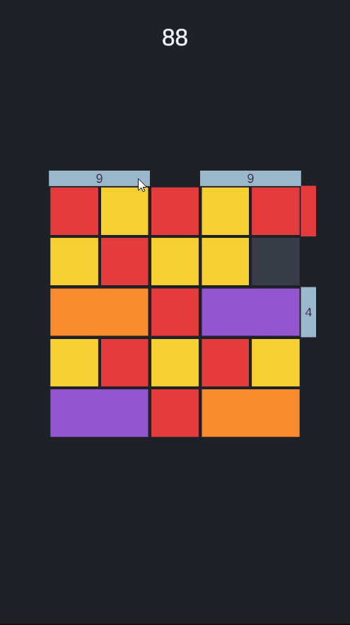
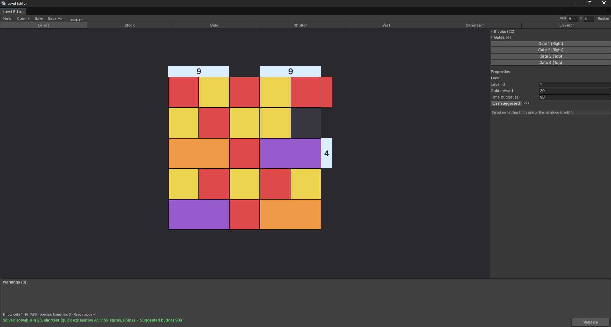
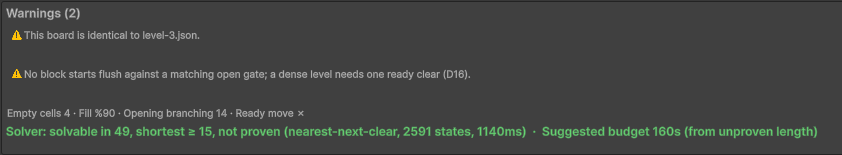

# Gate Rush

A Unity reimplementation of the sliding-block puzzle *Block Out!* by Grand Games,
built as a portfolio project with an emphasis on engine-independent game logic,
solver-verified level design, and a documented architecture.

<p align="center">
  
</p>

**▶ Play in browser:** *(coming with the first web build — Phase 3)*

Unity 6000.3.22f1 (6.3 LTS) · Universal Render Pipeline, 2D Renderer · WebGL and
Android

**Status:** work in progress. The puzzle core, the solver and the level editor
are built (Phase 1), and the game is playable in the editor: levels load,
blocks glide cell by cell, cleared blocks leave through their gates, and each
level runs against a countdown (Phase 2). The first web build is next. See
[`docs/ROADMAP.md`](docs/ROADMAP.md).

---

## What it is

Blocks slide freely across a tightly packed grid and are pushed out through
colour-matched gates on the board edges. Moves are unlimited; the only pressure
is a countdown. Ten interacting mechanics layer on top: count-gated gates and
blocks, layered colour stacks, shutters, block generators, elevators, axis
restrictions, and lock-and-key pairs.

## What is interesting about it

**The rules do not know Unity exists.** Board logic and search — and, once it
is built, the economy — are plain C# in assemblies compiled with engine
references disabled, so the layer boundary is a compile error, not a
convention. The entire rule set runs in an Edit Mode test suite in
milliseconds, without loading a scene.

**Levels are proved solvable before they ship.** A custom editor window
validates every level on demand: an exhaustive A\* search first, then — for
levels too large for it — a nearest-next-clear search that commits to one clear
at a time — complete wherever a monotonicity argument holds, and cross-checked
by A\*.
It answers three ways — solvable, unsolvable, or indeterminate within budget —
and says whether a solution's length is proven shortest. That length produces
the level's suggested time budget, so difficulty pacing is measured rather than
guessed.

**Ten mechanics compose without knowing about each other.** Every removal in the
game emits one event; every unlock condition listens to that event; the resolver
loops to a fixpoint. A single clear can release a key that unlocks a block,
cross a shutter's threshold and open it, and empty an elevator's region so its
next wave arrives — all within one move, with no mechanic referencing another.

**The search space is stratified, not cyclic.** Because blocks leave the board
permanently, progress counters increase monotonically, so the state graph is a
one-way layering of strata. Breadth-first search discards each stratum's
visited set on advance, bounding memory to the largest single stratum rather
than the whole space; nearest-next-clear searches one stratum at a time. This
is the structural difference from Rush Hour–style puzzles, where nothing is ever
removed.

## The level editor

<p align="center">
  
</p>

Every mechanic is authored in one editor window: blocks, gates, shutters,
walls, generators and elevator waves. Warnings update live as the level is
built, and **Validate** runs the solver off the main thread. The footer above
reads *solvable in 26, shortest*, with the states explored, the time taken and
the countdown the level should get.

<p align="center">
  
</p>

The warnings catch authoring mistakes before the solver runs: a colour with
no gate to leave through, a gate too narrow for a block, a lock without
enough keys, a board that is an exact copy of another level. They never
block saving; they are what a designer reads while building.

## Architecture

```
Core            board rules            no engine references
Solver          search                 no engine references, editor-only
Meta            economy, lives         no engine references
Platform        service interfaces     no engine references
Serialization   JSON DTOs
Runtime         MonoBehaviours, DOTween, input
UI              screens and navigation
```

Full write-up: [`docs/ARCHITECTURE.md`](docs/ARCHITECTURE.md)

## Documentation

| Document                                       | Contents |
|------------------------------------------------|---|
| [`docs/ARCHITECTURE.md`](docs/ARCHITECTURE.md) | Layers, dependency rules, core concepts |
| [`docs/MECHANICS.md`](docs/MECHANICS.md)       | Normative rules for all ten mechanics |
| [`docs/DECISIONS.md`](docs/DECISIONS.md)       | Decision record with rejected alternatives |
| [`docs/Modules/`](docs/Modules/)               | Per-module specifications |
| [`docs/CONVENTIONS.md`](docs/CONVENTIONS.md)   | Coding standards |
| [`docs/ROADMAP.md`](docs/ROADMAP.md)           | Build order |

## On process

The implementation was written with Claude Code. The architecture, the mechanic
rules, and the module specifications in `docs/` are mine; they were written first
and the code was written against them. `DECISIONS.md` records what was chosen,
why, and what was rejected — including dropping procedural level generation in
favour of a hand-authoring editor with live solver validation.

## Running the tests

Unity → Window → General → Test Runner → Edit Mode → Run All

None of the suites needs a scene: `Core`, `Solver`, `Serialization` and the
editor's logic are all tested headless.

## Note on the web build

Progress is stored in browser storage. Clearing site data will reset it.
